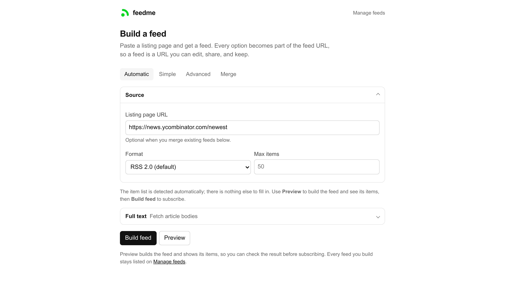
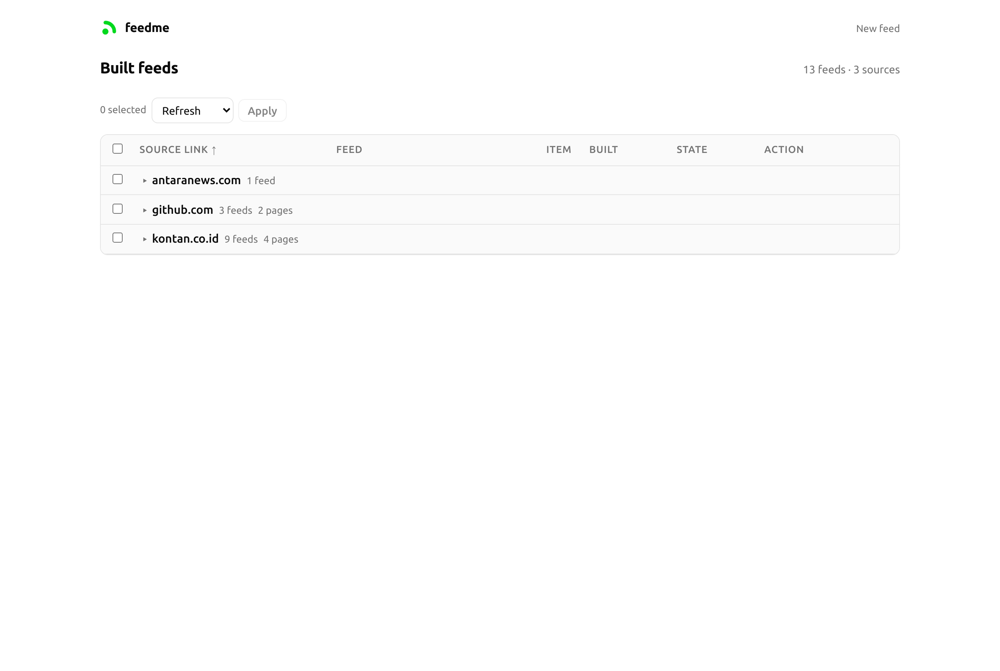

# feedme

### RSS feed creator

Turn any web page into an RSS 2.0, Atom 1.0, or JSON Feed 1.1 feed, including
sites that publish no feed of their own — then read it in any feed reader.

Every option of a feed lives in its feed URL, so a feed is a URL you can edit,
share, and keep. There is nothing to register first: the server builds a feed
the first time it is requested.

It also merges: give it existing feeds and it will combine, filter, and — with
`fulltext=1` — upgrade them to full article text.





```
http://localhost:8080/extract?url=https://example.com/news&id_or_class=news-item&fulltext=1
http://localhost:8080/extract?feeds[]=https://a.example/rss&feeds[]=https://b.example/feed.xml&fulltext=1
```

## Quick Start

```sh
make all            # vet, test, and build ./bin/feedme
./bin/feedme serve  # listen on :8080
```

Go 1.25 or newer. Each [release](https://github.com/ardi4s/feedme/releases)
carries the binary as a tarball for linux/amd64 and linux/arm64. The
[container image](https://github.com/ardi4s/feedme/pkgs/container/feedme) is the
other way in.

### Docker

```sh
mkdir -p data
docker compose up -d
```

The database is a bind mount at `./data/feedme.db`. Set `FEEDME_ADMIN_TOKEN` to
put the management page behind a password.

## Documentation

| Topic | File |
| --- | --- |
| **Endpoints** | [docs/endpoints.md](docs/endpoints.md) |
| **Parameters** | [docs/parameters.md](docs/parameters.md) |
| **Google News & Alerts** | [docs/google-news.md](docs/google-news.md) |
| **Caching** | [docs/caching.md](docs/caching.md) |
| **Site Configs** | [docs/site-configs.md](docs/site-configs.md) |
| **Configuration File** | [docs/config-file.md](docs/config-file.md) |
| **Headless Browser** | [docs/headless-browser.md](docs/headless-browser.md) |
| **Managing Feeds** | [docs/managing-feeds.md](docs/managing-feeds.md) |
| **Security** | [docs/security.md](docs/security.md) |
| **Limitations** | [docs/limitations.md](docs/limitations.md) |
| **Merging Feeds** | [docs/merging-feeds.md](docs/merging-feeds.md) |
| **Development** | [docs/development.md](docs/development.md) |

## Feed Readers

A feedme feed is a URL you paste into a reader: nothing on the source site
points at it, so add the `/extract` URL itself rather than the site's home page.
Any reader that accepts a pasted feed URL will do. Six open-source ones:

| Reader | Platform | License |
| --- | --- | --- |
| [yarr](https://github.com/nkanaev/yarr) | Windows, macOS, Linux — desktop app or self-hosted web | MIT |
| [Fluent Reader](https://github.com/yang991178/fluent-reader) | Windows, macOS, Linux — desktop app | BSD-3-Clause |
| [FreshRSS](https://github.com/FreshRSS/FreshRSS) | Self-hosted server — web UI, or any device through its API | AGPL-3.0 |
| [Read You](https://github.com/ReadYouApp/ReadYou) | Android | GPL-3.0 |
| [Feeder](https://github.com/spacecowboy/feeder) | Android | GPL-3.0 |
| [Twine](https://github.com/msasikanth/twine) | Android, iOS | GPL-3.0 |

## License

MIT
